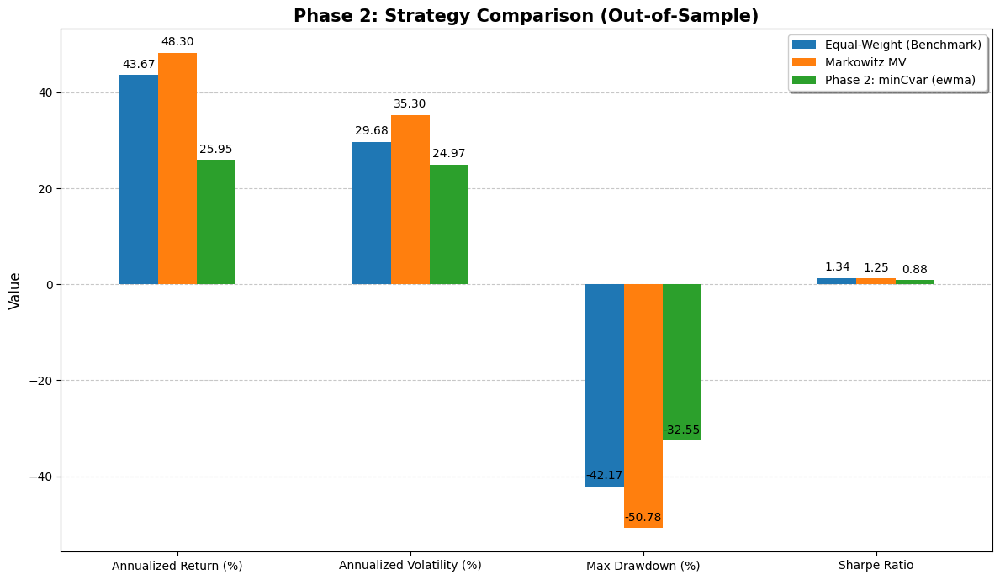

# Portfolio Optimization Project

A modular quantitative finance framework for portfolio construction and walk-forward backtesting, spanning classic Markowitz theory through advanced risk modeling.

## Phases

**Phase 0 — Equal-Weight Benchmark**  
1/N allocation used as the baseline for all comparisons.

**Phase 1 — Markowitz MVO**  
Ledoit-Wolf shrinkage + SLSQP max-Sharpe optimization with Tikhonov regularization. Tested walk-forward out-of-sample.

**Phase 2 — Advanced Risk & Optimization** *(new)*

- **Robust covariance**: EWMA (exponentially weighted), denoised via Random Matrix Theory (Marchenko-Pastur), or regime-aware (auto-scales in stressed markets)
- **Advanced optimizers**: Minimum CVaR (Rockafellar-Uryasev LP), Risk Parity (equal risk contribution), Maximum Diversification
- **Richer transaction costs**: commission + half-spread + Almgren-Chriss market impact
- **Full tearsheet**: Sortino, Calmar, Omega, CVaR at 95/99%, drawdown duration, CAPM decomposition

## Project Structure

```text
src/
├── dataLoader.py           # yfinance wrapper
├── metrics.py              # Mean returns & covariance estimation
├── markowitzOptimizer.py   # Max-Sharpe SLSQP optimizer
├── evaluator.py            # Walk-forward backtester (Phase 0–1)
├── vizualization.py        # Efficient frontier & performance plots
├── robustCovariance.py     # EWMA / denoised / regime-aware covariance
├── advancedOptimizer.py    # CVaR / risk parity / max diversification
├── transactionCosts.py     # Commission + spread + market impact model
├── advancedMetrics.py      # Full tearsheet metrics
└── advancedEvaluator.py    # Walk-forward backtester (Phase 2+)
main.py                     # PortfolioEngine orchestrator
main.ipynb                  # Interactive research notebook
tests/                      # pytest test suite
requirements.txt
```

## Quick Start

```bash
pip install -r requirements.txt
```

```python
from main import PortfolioEngine

portfolio = PortfolioEngine(
    tickers=['NVDA', 'MSFT', 'AAPL', 'GOOGL', 'TSLA'],
    startDate='2015-01-01',
    endDate='2024-01-01',
    splitDate='2020-01-01',
    riskFreeRate=0.04,
    meanMethod='arithmetic',
    shrinkage='ledoit',
    rebalancingPeriod='Q',
    transactionCostRate=0.001,
    initialCapital=100000,
    # Phase 2
    covarianceMethod='ewma',         # 'ewma' | 'denoised' | 'regimeAware'
    optimizationMethod='minCvar',   # 'minCvar' | 'riskParity' | 'maxDiversification'
)

portfolio.runAnalysis()   # runs Phase 0 → 1 → 2
```

## Quick Results Summary

The out-of-sample backtest demonstrates the practical tradeoffs of advanced portfolio optimization. While the traditional Markowitz Mean-Variance model achieved the highest annualized return (48.30%), it demonstrated classic "error maximization" by over-concentrating in high-beta tech assets, resulting in a fragile portfolio and a severe -50.78% maximum drawdown. Conversely, the minCVaR (EWMA) strategy successfully functioned as a tail-risk mitigator. By actively rotating out of volatile assets and into stable market anchors, it restricted the maximum drawdown to -32.55% and lowered annualized volatility to 24.97%, deliberately trading absolute upside for robust capital preservation during severe market shocks.


## Roadmap

- [x] Phase 0: Equal-weight benchmark
- [x] Phase 1: Markowitz MVO + walk-forward backtesting
- [x] Phase 2: Robust covariance + CVaR / risk parity / max diversification
- [ ] Phase 3: GARCH volatility forecasting
- [ ] Phase 4: ML return prediction (XGBoost + purged cross-validation)
